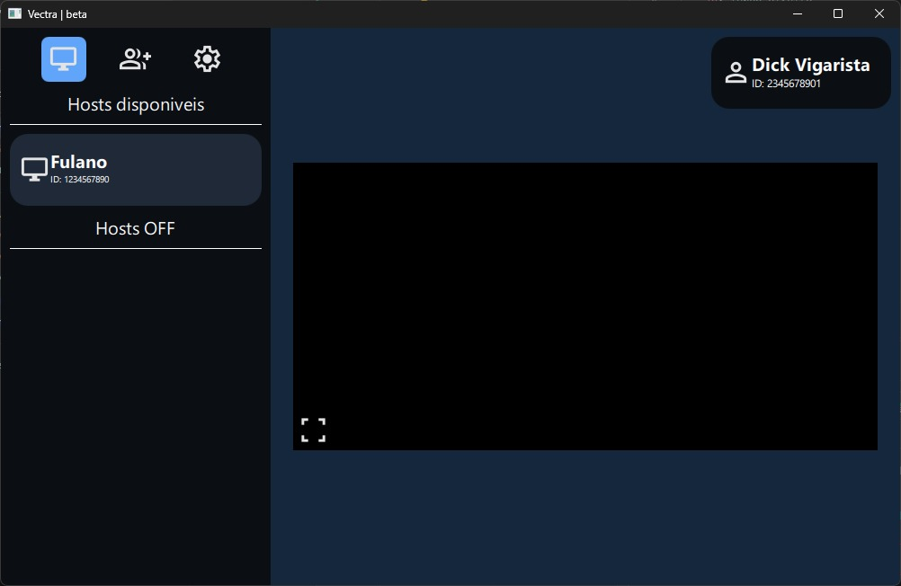

<h1 align="left">Vectra</h1>

###

Ferramenta de streaming remoto para games.

###

<h2 align="left">Sobre</h2>

###

Ferramenta de streaming remoto focada em jogos, com funcionalidades voltadas a auxiliar o público gamer a jogar, de qualquer lugar, sua biblioteca de jogos de qualquer plataforma de desktop gaming. O ecossistema unifica o acesso aos seus launchers favoritos em uma interface minimalista e intuitiva, eliminando as configurações complexas de rede das ferramentas tradicionais do mercado.

###

<h3 align="left">Modelos desktop</h3>

###

  

  

  

###

<h3 align="left">Modelos mobile</h3>

###

<h2 align="left">Construido com</h2>

###

  
  
  
  
  

###